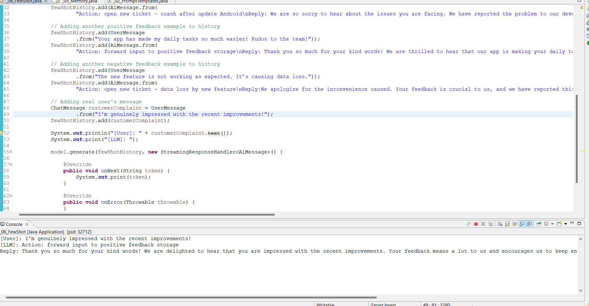

# JavaChainMagic: Integrate LangChain AI into Your Java Applications

## Overview

Add a touch of AI 'Magic' to your Java applications effortlessly. Integrate 'Chain' from LangChain4J.

### -Prompt Templates - Recipe Creation for example
Utilize predefined templates to easily create custom replays. In the provided example, a template is used to generate a recipe for an oven dish with specified ingredients. Simply replace variables like `{{dishType}}` and `{{ingredients}}` to tailor the recipe to your preferences.

### -Structured Prompt Templates - Medical Insurance Plans for example
With the provided template, you can easily create customized insurance plans by filling in the required parameters like `{{coverageType}}` for example.

### -Streaming Generation in Java
Streaming generation allows you to receive model responses in real-time, which is useful for long-running conversations or dynamic content by using OpenAiStreamingChatModel.

### -Chat Memory Handling in Java
The chat memory allows you to maintain context and history during a conversation. This enhances the interaction with the OpenAiStreamingChatModel, allowing the model to provide responses that are contextually relevant based on the conversation history.

### -Few Shot with chat memory
Abuse the memory to do what you want to do, also used in the fine-tuning 

##### The output of negative feedback for example:

##### And this is for positive feedback:

